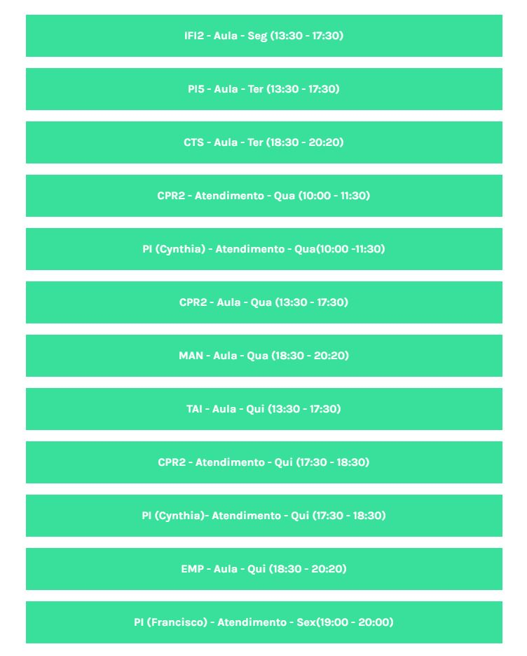
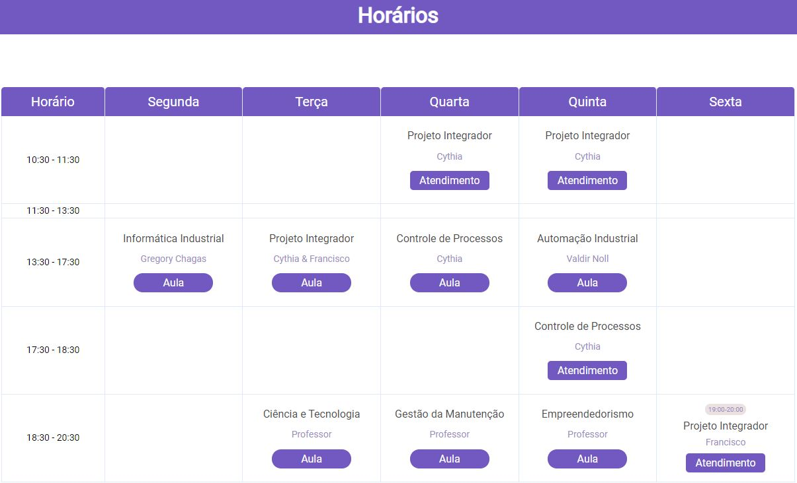

<div align="center">
 <a href="#rocket-class-schedules">Project</a> •
 <a href="#camera-screenshot">Screenshot</a> •
 <a href="#globe_with_meridians-links">Links</a> •
 <a href="#hammer_and_wrench-technologies">Technologies</a> •
 <a href="#arrow_forward-run">Run</a> •
 <a href="#boy-author">Author</a>
 </div>

## :rocket: **Class schedules**

This project arose out of a need. In the past, it was difficult to see class schedules.

## :camera: **Screenshot**

<h2 align="center">• Before •</h2>
<div align="center">

</div>

<h2 align="center">• After •</h2>
<div align="center">

</div>
## :globe_with_meridians: **Links**

- Url: [Schedule](https://schedule-92nlxpvl5-evertonvargas.vercel.app/)

## :hammer_and_wrench: **Technologies**

- Html5
- Css Grid
- [Sass](https://sass-lang.com/) - CSS Preprocessor 
- [React](https://reactjs.org/) - JS library


## :arrow_forward: **Run**

To run the project you need to clone or download this repository, have the Node Package Manager (NPM) or the YARN Package Manager installed (YARN).

```bash
$ git clone https://github.com/evertonvargas/schedule.git
```

Follow the steps below:
```bash
# Install the dependencies
$ npm

# Start the project
$ npm start
```
The app will be available for access on your browser at http://localhost:3000
## :boy: **Author**

<a href="https://github.com/evertonvargas">
  
</a>
